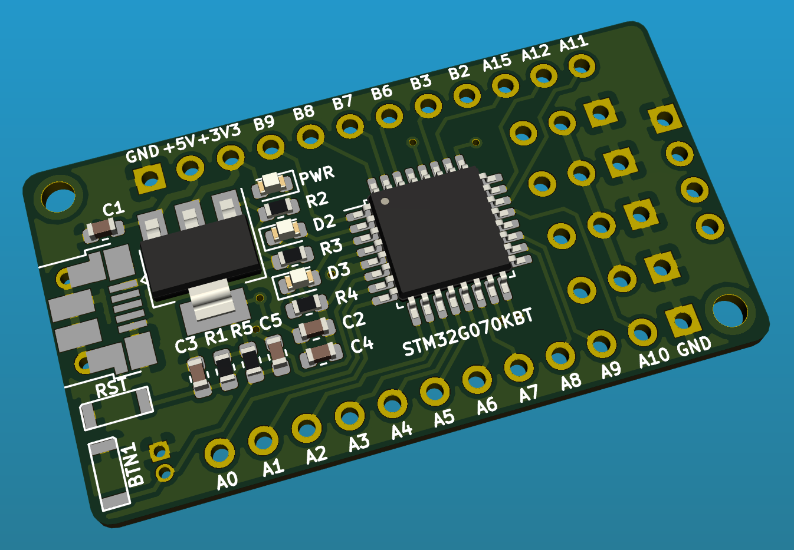

# SHIM

Tiny ARM Cortex-M0+ Development/Prototyping board.

## Features

- USB VBUS, ext. VIN, ext. 5V, ext +3.3V 
- Push-buttons: User and Reset 
- LEDs: Power, 2 User LEDs
- Connectors: 2 GPIO, 4 PWM, 1 SWD
- Breadboard friendly

## Resources

- [Schematics](docs/schematics.pdf)
- [Gerber files](docs/fabrication.zip)
- [BOM](docs/bom.csv)
- [KiCad project](kicad/)
- [Rust firmware for 4-DOF robotic arm toy](src/)

## License

Licensed under either of

- Apache License, Version 2.0 ([LICENSE-APACHE](LICENSE-APACHE) or
  http://www.apache.org/licenses/LICENSE-2.0)
- MIT license ([LICENSE-MIT](LICENSE-MIT) or http://opensource.org/licenses/MIT)

at your option.

### Contribution

Unless you explicitly state otherwise, any contribution intentionally submitted
for inclusion in the work by you, as defined in the Apache-2.0 license, shall be
dual licensed as above, without any additional terms or conditions.